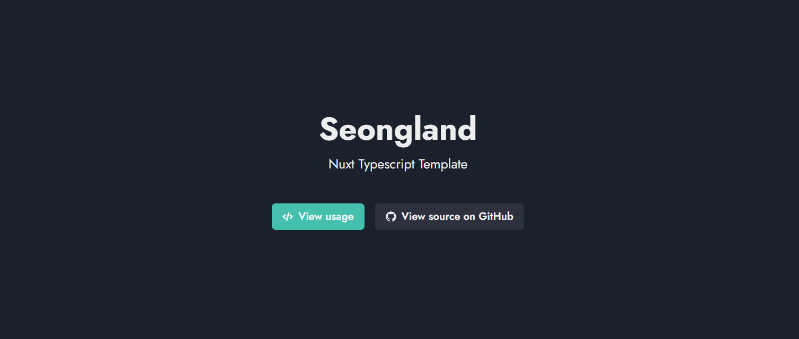

# Minimal Next JS Typescript Template

Fork of [Nextplate](https://github.com/nextplate-dev/nextplate)

- [Vercel Demo](https://nextra-ts.vercel.app)



## Get Started

- `Use this template` Button on Github
- Or Clone this Project

```bash
git clone https://github.com/seonglae/next-ts-template
pnpm i
pnpm dev
```

## Components

### Modules

- Next js
- Chakra UI

### Develop Tools

- Prettier
- CI/CD
  - Github Action - CI
  - Vercel - CD

## Publish

- Sitemap
- PWA

## Philosophy

- Atomic Design Pattern
- Minimalism
